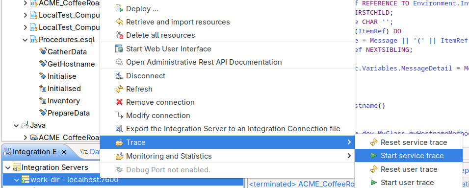

# ⚠️IAM2 ESQL Coverage Evaluator (Python Port)⚠️

This is a Python port of the IAM2 SupportPac evaluator script (v1.0.6). It analyzes IBM Integration Bus (IIB) / App Connect Enterprise (ACE) **UserTrace/ServiceTrace** logs and **ESQL/CMF** source to generate detailed **code coverage** for ESQL functions and procedures.

---

## Features
- Parse trace lines (UserTrace or ServiceTrace) via a configurable **`tracelog.pattern`** regex.
- Optional filters for **modules** and **functions/procedures**.
- Maps executed statements to ESQL and expands **multi-line statements** and **control blocks** (IF, CASE, LOOP, WHILE, FOR, REPEAT, BEGIN ATOMIC, named variants) so all relevant lines are marked executed.
- Produces a plain-text report with:
  - Executed vs. executable lines per function/procedure
  - Comments/blank lines counts
  - Coverage % per function and total
  - Line-by-line indicators: `[x]` executed, `[ ]` not executed

> **Compatibility**: Works with trace lines that include `BIP2537I: ... Executing statement ... at (<func>, <line>).` (commonly found in both UserTrace and ServiceTrace).

---

## Prerequisites
- **Python 3.7+**
- No third-party modules required
- Enable service trace from the toolkit:
  

- alternatively you could also enable it from the Intergration Server Unit Test configuration dialog:

- subsequently create a Test Case which runs the particular ESQL that you want to test

---

## Files
- `evaluator.py` – main tool
- `tracelog.pattern` – regex to extract **function** and **relative line** from trace
- `filterModules.txt` – *(optional)* one module name per line to exclude
- `filterFunctionProcedure.txt` – *(optional)* one procedure/function per line to exclude

---

## Installation
Place `evaluator.py` and `tracelog.pattern` in a working folder (along with optional filter files). Ensure your ESQL/CMF and trace files are accessible.

---

## Usage
```bash
python3 evaluator.py <userTraceOrServiceTrace> <source.esql|.cmf> <report.txt> \
  --pattern tracelog.pattern \
  [--filter-modules filterModules.txt] \
  [--filter-funcs filterFunctionProcedure.txt]
```

Example:
```bash
python3 evaluator.py trace.log MyFlow.cmf coverage_report.txt --pattern tracelog.pattern
```

---

## `tracelog.pattern` (with comments enabled)
The evaluator compiles patterns with `re.VERBOSE` and `re.IGNORECASE`, so **`#` comments** and multi-line formatting are allowed. Multiple non-empty lines are merged with `|` (OR). The evaluator expects two capture groups **or** two named groups:

- **Group/Name 1** → function/proc FQN (e.g., `.LocalTest_Compute1.Main`)
- **Group/Name 2** → relative line (e.g., `4.4` → coerced to `4`)

**Recommended (named groups):**
```regex
# Generic pattern for: at (<func>, <line>).
at\s*\(\s*'?(?P<func>[.\w]+)'?\s*,\s*'?(?P<line>[0-9]+(?:\.[0-9]+)?)'?\s*\)\.

# Strict BIP2537I variant (reduces false positives)
BIP2537I:\s*Node\s+'.+?':\s*Executing\s+statement\s+'.*?'\s+at\s*\(
    \s*'?(?P<func>[.\w]+)'?\s*,\s*'?(?P<line>[0-9]+(?:\.[0-9]+)?)'?\s*\)\.
```

> If you use positional groups instead of named groups, ensure the **function** is capture group 1 and the **line** is capture group 2.

---

## End-to-End Example (ServiceTrace + ESQL)

### 1) Example ServiceTrace/UserTrace snippet
Save as `trace.log`:
```text
2025-09-02 09:59:43.302748   502564   UserTrace   BIP2537I: Node 'LocalTest.Compute1': Executing statement   'SET OutputRoot.HTTPReplyHeader.Content-Type = 'text/html; charset=utf-8';' at (.LocalTest_Compute1.Main, 4.4).
```

> The tool accepts both **UserTrace** and **ServiceTrace** as long as the line contains the `Executing statement ... at (<func>, <line>).` part.

### 2) Example ESQL (or CMF) snippet
Save as `LocalTest_Compute1.esql`:
```esql
CREATE SCHEMA LocalTest PATH 'some/path';

CREATE COMPUTE MODULE LocalTest_Compute1
  CREATE FUNCTION Main() RETURNS BOOLEAN
  BEGIN
    -- Set HTTP header (will be marked executed)
    SET OutputRoot.HTTPReplyHeader."Content-Type" = 'text/html; charset=utf-8';

    -- Not executed in this example
    SET OutputRoot.JSON.Data.message = 'hello';

    RETURN TRUE;
  END;
END MODULE;
```

### 3) Pattern file
Save as `tracelog.pattern`:
```regex
# Generic at(...) pattern with named groups
at\s*\(\s*'?(?P<func>[.\w]+)'?\s*,\s*'?(?P<line>[0-9]+(?:\.[0-9]+)?)'?\s*\)\.
```

### 4) Run the evaluator
```bash
python3 evaluator.py trace.log LocalTest_Compute1.esql coverage_report.txt --pattern tracelog.pattern
```

### 5) Expected report (excerpt)
```text
ESQL Source Code: LocalTest_Compute1.esql
User Trace Log : trace.log
Execution time : 2025-09-02 10:05:12

IAM2 version : 1.0.6
-------------------------
Overview of Code Coverage
-------------------------
Total Functions & Procedures: 1

'.LocalTest_Compute1.Main'
Lines : 6 (1 comment and 1 blank lines)
Executed Lines : 1 of 4 executable lines
Percent comment : 20.0%
Code coverage : 25.0%

Total Executed Lines : 1 of 4 executable lines
Total Code Coverage : 25.0%

------------------------
Details of Code Coverage
------------------------
[x] 1: BEGIN
[x] 2: SET OutputRoot.HTTPReplyHeader."Content-Type" = 'text/html; charset=utf-8';
[ ] 3: SET OutputRoot.JSON.Data.message = 'hello';
    4: -- Set HTTP header (will be marked executed)
[ ] 5: RETURN TRUE;
[x] 6: END;
```
*(Line numbers and counts are illustrative; your exact counts will reflect the parsed function body.)*

---

## Filters (optional)
- `filterModules.txt`: put each module name (e.g., `LocalTest_Compute1`) on its own line to exclude it.
- `filterFunctionProcedure.txt`: put function/procedure names (e.g., `Main`) to exclude them.

---

## SonarQube Integration (Generic Test Coverage XML)

This tool can export a **SonarQube Generic Test Coverage** XML report (coverage `version="1"`), which you can import using the `sonar.coverageReportPaths` property. See SonarQube docs for the generic format and parameters.

### Generate the XML

```bash
python3 evaluator.py trace.log LocalTest_Compute1.esql coverage_report.txt \
  --pattern tracelog.pattern \
  --sonar-coverage-xml sonar-coverage.xml
```

This creates `sonar-coverage.xml` like:

```xml
<coverage version="1">
  <file path="LocalTest_Compute_1.esql">
    <lineToCover lineNumber="12" covered="true"/>
    <lineToCover lineNumber="13" covered="false"/>
  </file>
</coverage>
```

> The report includes only **executable lines** inside ESQL functions/procedures; comments and blank lines are excluded.

### Import into SonarQube

1. Ensure the reported file path matches your project structure (absolute or relative paths are accepted).
2. Configure your scanner (example `sonar-project.properties`):

```properties
sonar.projectKey=your-project
sonar.sources=.
sonar.coverageReportPaths=sonar-coverage.xml
```

3. Run your SonarScanner as usual; the coverage will appear on the project dashboard.

**References**: SonarQube generic coverage format & parameter `sonar.coverageReportPaths` (official docs). 

---

## Troubleshooting
- **No matches found**: Verify `tracelog.pattern`—use the generic `at(...)` rule first. Ensure the log line is not wrapped.
- **Different trace wording**: Add an additional pattern line to match that wording; keep the same capture groups.
- **Decimal line numbers (e.g., 4.4)**: The tool coerces to integer line indices inside the function body.

---

## License / Attribution
Original Perl logic © IBM Corp. (SupportPac IAM2, v1.0.6). This Python port preserves behavior for educational/operational compatibility.
